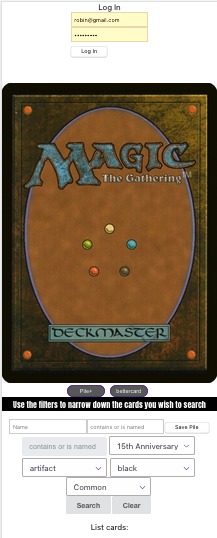

# MTG PILE
Mtg Pile is a simple web app built with react and uses the mtg api to get lists of cards. You don't have to login to search.

## Installation

No installation nesscary you can just go to this link.

[mtg pile get started here](https://mtg-pile.herokuapp.com)

## Technologies Used

- React
- Express
- Node
- MongoDB/Mongoose
- Html
- CSS
- JavaScript
- Heroku
- MTG API 
- (future ICEBOX) More Animations
- (future ICEBOX) More Features
- (future ICEBOX) Saving piles

### future plans
- Links to buy sites
- landing page
- debugging

truth be told this is a app I built on my own so I can learn react. I have to say it hits pretty hard.
